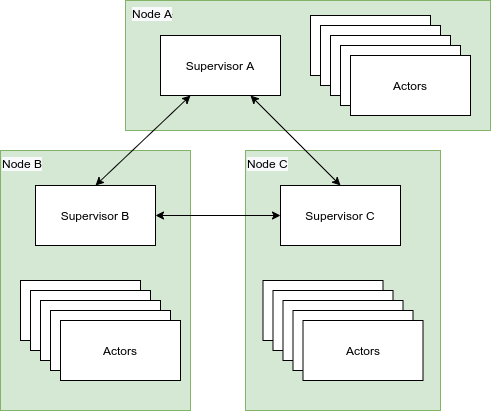

# Just testing some Java 16 Features

Testing Java 16 features by implementing a framework Actor model framework.

## Java 16 Features tested
* ~~SIMD Instruction Vectorization~~
* Unix-Domain Socket Channels
* ~~Pattern Matching for instanceof~~
* ~~Records~~
* Sealed Classes

## framework.Actor Framework Goal Features

### Actors:

Actors can:
* ~~Send messages to other actors given their id~~
* ~~Accept messages from other actors~~
* ~~Spawn other actors~~
* Supervise other actors

Properties:
* ~~Decoupled from other actors~~
* ~~Queued message inbox~~
* ~~Asynchronous communication~~
* ~~Concurrent and non-blocking~~

### Framework

## General Implementation Ideas And Requirements

The program should be bootstrapped by spawning one or more Actors and sending them messages to drive the 
program state forward. The bootstrapping itself should be done by an actor, so it can restart failed child nodes.

I need a mechanism to spawn a new Actor without coupling the Actors through code so no Class as parameter.
I want to be able to spawn actors across networks/processes.

Actors could be spawned by ClassName and spawning should return an ID to that Actor. Messages sent to this id
should reach the Actor mailbox and include the sending Actor ID and the message. 
Any Actor spawned by an actor should be considered a child. If a child exits exceptionally, 
the parent should be notified. If a parent dies all children should be killed.

On idea is to have a central registry that handles spawning Actors and routing messages. 

## Issues to solve

* Delivery Guarantees ( At-least-once most likely )
* Algorithm for spreading actors over nodes while maintaining spawn hierarchies
* Discovery mechanism for nodes
* Mechanism for keeping track of spawn hierarchies and bubbling notifications up the tree

## End Goal
Spawning an actor can be done from any node in the cluster and actors are spread evenly. If an actor dies, a supervisor on some
node should be notified. Messages are automatically routed to the correct node and correct actor

